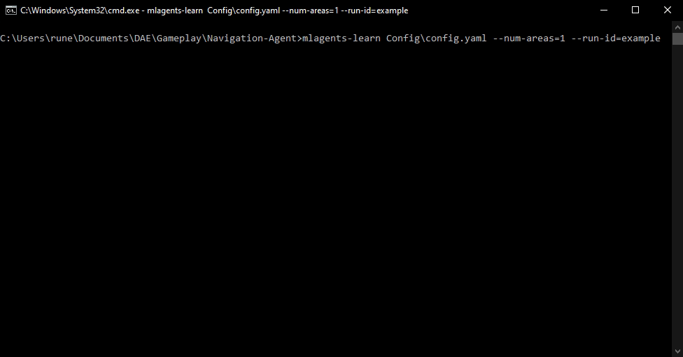
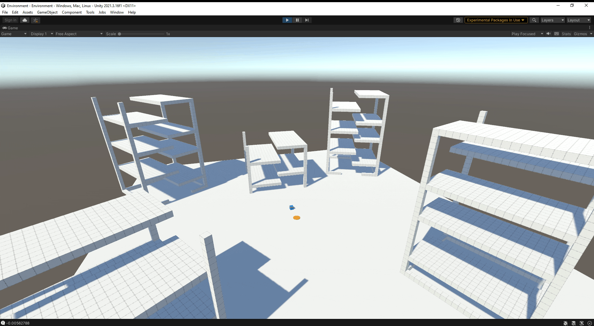
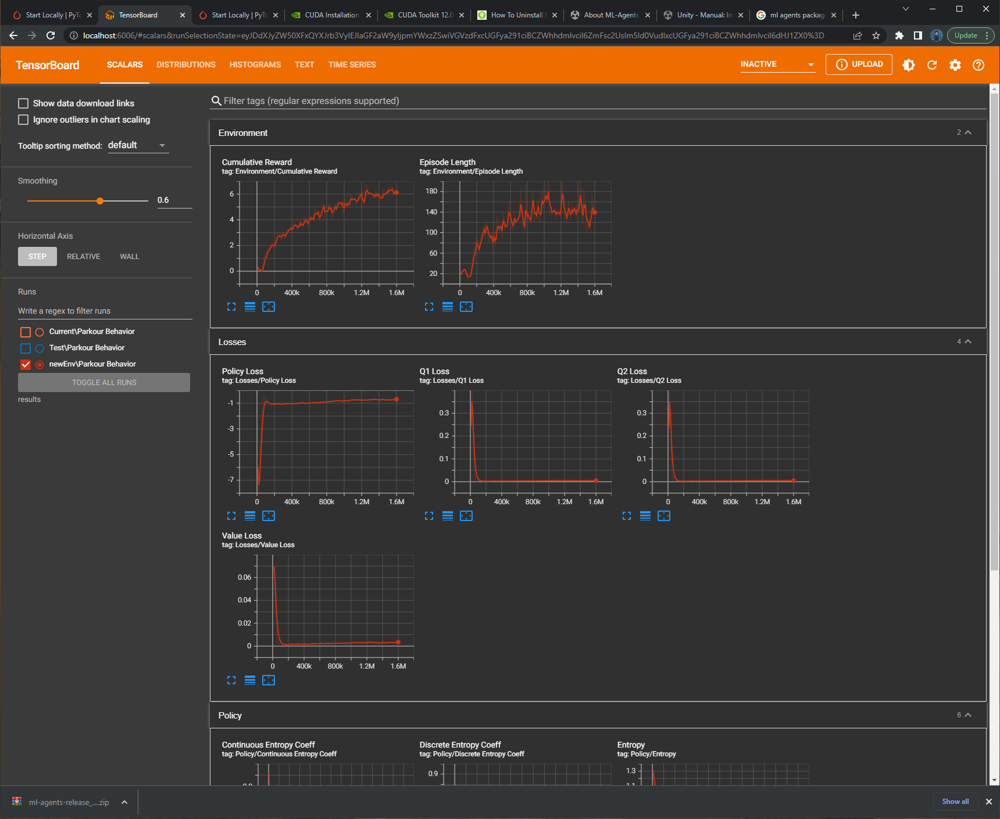

# Navigation-Agent
Deep Reinforcement Learning for Navigation

This research project will be about the genetic algorithm, in this short paper I will attempt to recreate the [Deep Reinforcement Learning for Navigation in AAA Video Games](https://montreal.ubisoft.com/en/deep-reinforcement-learning-for-navigation-in-aaa-video-games/) by Ubisoft originally made for the game Hyper Scape. The end goal for this AI is to navigate complex terrains with custom movement and environmental movement like jump pads.

## Abstract
A crucial part of non-player characters (NPCs) in games is navigation, which allows them to move from one point to another on a map. The most popular approach for NPC navigation in the video game industry is to use a navigation mesh (NavMesh), which is a graph representation of the map whose nodes and edges indicate traversable areas. Unfortunately, complex navigation abilities that extend the character’s capacity for movement, e.g., grappling hooks, jetpacks, teleportation, jump pads, or double jumps, increase the complexity of the NavMesh, making it infeasible in many practical scenarios.


# Design
## General
For this research we will use unity and their [ml-agents](https://github.com/Unity-Technologies/ml-agents) library which is based on [PyTorch](https://pytorch.org/) and the backend is made with [Barracuda](https://docs.unity3d.com/Packages/com.unity.barracuda@1.0/manual/index.html) a lightweight cross-platform neural network inference library for Unity.

## Algorithms
### Proximal Policy Optimization (PPO) versus Soft Actor Critic (SAC)

| PPO                                                 | SAC                                        |
| --------------------------------------------------- | ------------------------------------------ |
| Works in both discrete and continuous action spaces | Works in a continuous action space         |
| On-policy                                           | Off-policy                                 |
| Uses entropy regularization                         | Adds entropy to the maximization objective |

#### Stable vs. Data Hungry
PPO uses on-policy learning which means that it learns its value function from observations made by the current policy exploring the environment.
SAC uses off-policy learning which means that it can use observations made by previous policies' exploration of the environment

Our environment game engine can be costly to sample from so here we will go with SAC.


# Implementation

## Behavior
We use ml-agents to do most of the heavy lifting. We just need to define our agent behavior.

This can be done by creating these simple functions.

```C#
public class ParkourAgent : Agent
{
    public Transform goal;
    private AgentControls controls;
    private Rigidbody rbody;
    ...

    public override void OnEpisodeBegin()
    {
        // The start of an episode
        // reset the agent and randomize the goal
        ...
    }

    public override void CollectObservations(VectorSensor sensor)
    {
        // Get and process all the input data the algorithm needs
        ...
    }

    public override void OnActionReceived(ActionBuffers actionBuffers)
    {
        // Respond to the actions that the agent takes
        // update the reward.
        ...
    }

    public override void Heuristic(in ActionBuffers actionsOut)
    {
        // Debug human controls
        ...
    }
}
```

## Brain
To create the algorithm that controls the agent we use an ml-agents config file.

```yaml
behaviors:
  Parkour Behavior:
    trainer_type: sac
    max_steps: 10000000
    time_horizon: 128
    summary_freq: 10000

    hyperparameters:
      batch_size: 64
      buffer_size: 4000000
      learning_rate: 3.0e-4
      learning_rate_schedule: constant

      buffer_init_steps: 1000
      tau: 0.005
      steps_per_update: 4
      save_replay_buffer: true
      init_entcoef: 0.5
      reward_signal_steps_per_update: 10.0

    network_settings:
      vis_encode_type: simple
      normalize: true
      hidden_units: 1024
      num_layers: 2
      memory:
        sequence_length: 64
        memory_size: 256

    reward_signals:
      extrinsic:
        gamma: 0.99
        strength: 1.0
```

# Reward
The reward we use is the same as in the reference paper.

`SetReward(Mathf.Max(clostestDistanceThisEpoch - distanceToTarget, 0) + rewardPerStep + (distanceToTarget <= minimumDistanceToGoal ? 1 : 0));`


## Training
To see how the agent is doing during training we can train it in editor or via a build.




We can also increase the amount of agents in one environment by repicating it. This can be controlled trough the cmd with `--num-areas=50`.



We can see the progress of training trough a locally hosted tensorboard.



After training the model is exported as an .onnx file which can be run by Barracuda inside unity.

# Result
Here is the agent after some training.


## Analysis
The agent still seems to have some trouble pinpointing the target, this can be a few things and the real problem is probably all of them combined.

### Not enough training
According to the tensorboard graphs, the agent was still improving. We stopped the training prematurely.

### Not enough observations
The agent has access to 15 floats to make its decision.
This is alot less than in the Deep Reinforcement Learning for Navigation in AAA Video Games](https://montreal.ubisoft.com/en/deep-reinforcement-learning-for-navigation-in-aaa-video-games/) paper.
They use box -and depthmaps that are not implemented here.

### Badly tuned hyperparameter
There are alot of hyperparamiters that can have a drastic change in the preformance of the algorithm.
Finetuning them can be done automatically but is compute expensive and finding them by trail and error is time expensive.
Here we took educated guesses for the values of the config file.
Further problems can arise from using `--num-areas`, this might the kind of data to be stored in the buffer and can have unwanted effects on training.

### Confusing controls
The agent has access to rotate itself. This changes the forward direction. for the ai figuring out how it should rotate/move with that complication takes alot more training time.
These controls were chosen in the hope that the AI would gain a more human playstyle. It is also important for the creation of the depthmap and boxmap from the agents fov.

### Wrong algorithm
The algorithm in the paper is a tiny bit more complex, but this is not reproducable with ml-agents config file.
We need to write our own algorithm in pytorch and link that to ml-agents. This way we can customize the agent alot more.


# Conclusion
This was definitly a step towards a full implementation but it is still in the testing phase.
We noted down what some of the core problems are with the current setup in the analysis section. Sadly there was not enough time to implement all these toughts.

I feel like I have a better understanding on how to guide an agent to train prorperly and effectively. Given enough time ~a week~ I could completely reproduce and improve on the original reference paper.


## Links
- [Deep Reinforcement Learning for Navigation in AAA Video Games](https://montreal.ubisoft.com/en/deep-reinforcement-learning-for-navigation-in-aaa-video-games/)
- [ml-agents](https://github.com/Unity-Technologies/ml-agents)
- [PyTorch](https://pytorch.org/)
- [Barracuda](https://docs.unity3d.com/Packages/com.unity.barracuda@1.0/manual/index.html)


